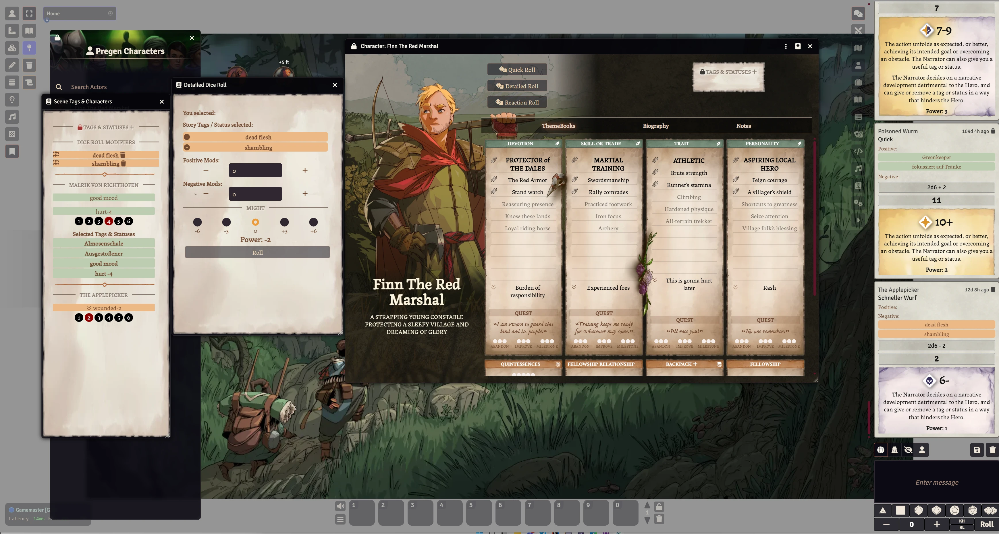

# Legend In The Mist for FoundryVTT

 

This is the official system implementation of Legend In The Mist from Son Of Oaks for FoundryVTT.

The system contains 3 official pregenerated characters with full artwork for free.

  
## KeyBindings  
 * Control + J -> Open Scene Tags
 * Control + H -> Open How To Play

## Manifest-URL for manual installation of the system

    https://github.com/MrTheBino/mist-engine-fvtt/releases/latest/download/system.json

## Tags & Status Markdown

You can use these formatting in almost every text field to display a MIST engine style tag or status

    [tag] - a simple tag
    [status-1] - a status with tier 1, tier 1-6
    [/s status] - a status without a tier, usage in a journal for example
    [/sn status] - a negative status
    [/sn status-1] - a negative status with a tier
    [/sg status-2] - a status with a green color instead of yellow
    [/so status-2] - a status with a orange color instead of yellow
    [/m might] - a might word with a sword icon before
    [/l limit] - a limit
    [/w weakness] - a weakness tag, usage in text and compendiums for example
    [/wo weakness] - a weakness tag in orange, usage in text and compendiums for example

An Example

    The fox jumps and [breaks-2] his leg. Now he's very [fatigued-2] and [sad]

This system uses at present code snippets and graphics from the City of Mist HUD module.

## Development

  npm install
  npm run watch (CSS live build)
  npm run pack-compendium (builds the foundry compendium entries)
  npm run unpack-compendium (unpacks the foundry compendium entries to json files in src/packs)

## Foundry VTT Preview Screenshot
