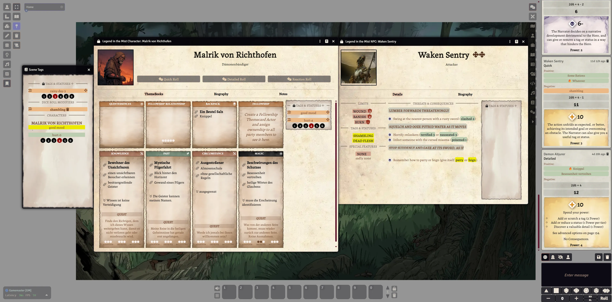

# Legend In The Mist - MistEngine for FoundryVTT

 

This is an unoffical system implementation of the MIST Engine from Son Of Oaks for FoundryVTT.

Currently it only supports Legend In The Mist.

## Features

* NPC / Adversary sheet
* Character sheets
* backpack, themebooks, fellowship relationships for character sheets 
* milestone, abandon,improve, promises development markers
* quick, detailed and reaction rolls
* burning power tags
* using weakness tags
* scene window dialog for handing scene and story markers / tags (found in the left sidebar under Journal Notes > Scene Tags)
* temporary statuses for characters and npcs
* enclose tags with [] in text forms, eg. [super cool] or [burning-3]
* drag'n'drop of tags & status from NPCs to characters, thanks to 3rddogpaul
* shared fellowship themebook / cards (needs more testing)
* special improvements for themebooks
* basic documentation of the system as a compendium
* all themebooks from Legend In The Mist are provided as compendium entries (only with their names and category, not the actual content from the rulebooks)
* reactive dice roll dialog
  
## Items
 * Quintessence
 * Themebooks
  
## KeyBindings  
 * Control + J -> Open Scene Tags
  
## ToDo

- improved styling
- usability improvements

## Manifest-URL for manual installation of the system

    https://github.com/MrTheBino/mist-engine-fvtt/releases/latest/download/system.json

## Why another system?

I like simplicity in FoundryVTT systems because I love it to prepare my sessions in Foundry. So, a fast way to prepare my sessions is my primary goal.
This system implementation is focused on entering adversaries, npcs and characters in a fast and easy way.

This system uses at present code snippets and graphics from the City of Mist HUD module.

## V0.3 Setup Guide

On youtube: https://youtu.be/cJqjzdLw5P4

